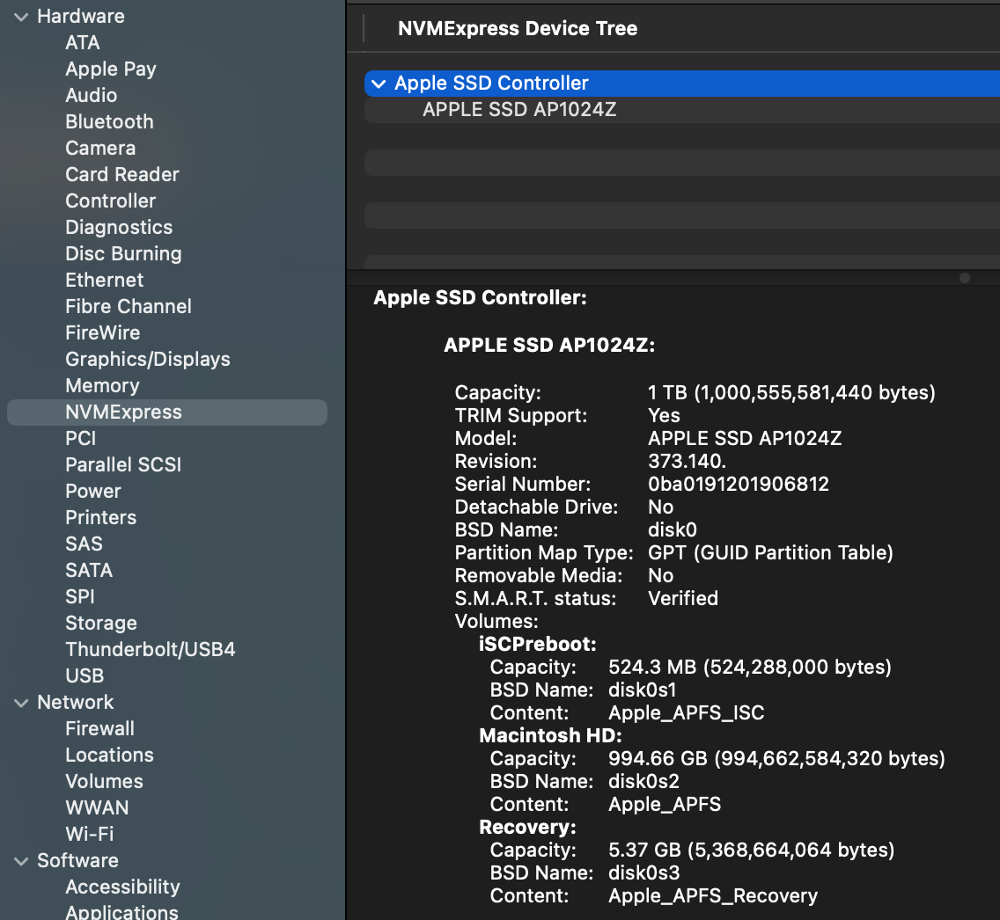

# Files (WIP)

Files have been the key metaphor for computer data since, like, the 1950s.  Conceptually they seem
simple: a collection of bits stored on some semi-permanent device with some associated metadata that identifies
that collection of bits as an isolated thing with a name.  But that description is simplistic.  Files
are deep eldritch magic.

## Storage

First, there are the details of that semi-permanent storage device.  Over my years in the biz that has been
everything from paper tape to the NAND Flash device (devices?) that make up my computer's 1 TB SSD.  They
are usually read/write although i've had read-only devices.  There has to be some low-level way for code to
read and write bits to specified places on those devices.  Typically there's a piece of controller hardware
that facilitates the process of taking bits from memory and moving them to storage.  I _think_ that in my
computer this is an NMVE controller, based on this from the System Report:



I confess this confuses me a bit, because i was under the impression that NVME is designed for PCIe bus devices,
whereas the "Physical Connection" listed for the NVME controller is "Apple Fabric".

SSDs and hard drives are _block devices_, meaning that reading and writing are done in chunks (blocks) of some specified size.
This makes sense since files are usually lots of bytes, so transferring data in blocks reduces the number of reads and writes.  The actual arrangement of storage on the device depends on the physical device.  A hard disk drive is one or more spinning disks with a set of concentric _tracks_, which are further organized into wedges of track called _sectors_. An SSD arranges data in blocks within pages similary to memory, which they basically are. Here I'll only talk about SSDs, since that's what my computer has, and I'm not even sure you can buy an Apple computer with a hard disk drive anymore.

Ideally you just grab data from memory and write a series of blocks to consecutive pages in a block; or vice-versa for reading (blocks are typically 4096 bytes).  That works fine so long as you never modify files.  Suppose that you write a file and it
gets stored in 3 consecutive blocks on the SSD.  Then write another file that gets stored in the next 3 blocks.  Now you add
something to the first file.  To keep it all together in storage you could relocate the second file to make room for the new
data, but what usually happens is that the new data is written to some other block after the second file.  Now multiply this
by a gajillion files being written and read constantly and clearly data for even a single file is going to be scattered
all around the physical device.

SSDs complicate this further because they don't allow you to write to a block that already has data in it.  You have to erase the block before you can write to it, and erasing is done in large chunks of blocks.  So when you modify a file, the new data is written to a new block and the old block is marked as invalid.  This is called "wear leveling" and it's one of the reasons why SSDs have a limited lifespan.

To illustrate this idea i'm going to use a slightly more complicated C program that uses the `fcntl` system call.

```c
#include <stdio.h>
#include <stdlib.h>
#include <fcntl.h>
#include <sys/fcntl.h>
#include <unistd.h>
#include <errno.h>

int main(int argc, const char * argv[]) {

    if (argc != 2) {
        fprintf(stderr, "Usage: %s <filename>\n", argv[0]);
        return 1;
    }

    int fd = open(argv[1], O_RDONLY);
    if (fd < 0) {
        perror("Error opening file");
        return 1;
    }

    struct log2phys l2p;
    off_t current_logical_offset = 0;
    off_t file_size = lseek(fd, 0, SEEK_END);
    
    // Reset to beginning
    lseek(fd, 0, SEEK_SET);

    printf("%-15s | %-15s | %-15s\n", "Logical Offset", "Physical Offset", "Length (Bytes)");
    printf("------------------------------------------------------------------\n");

    while (current_logical_offset < file_size) {
        // Set up the query: we want to know about the extent starting at this offset
        l2p.l2p_contigbytes = file_size - current_logical_offset;  // For F_LOG2PHYS_EXT: IN = bytes to query, OUT = contiguous bytes
        l2p.l2p_devoffset = current_logical_offset;  // For F_LOG2PHYS_EXT: IN = offset into file

        // F_LOG2PHYS_EXT queries the physical info for a given logical offset
        if (fcntl(fd, F_LOG2PHYS_EXT, &l2p) == -1) {
            // Some system files or compressed files might not support this
            if (errno == ENOTSUP) {
                fprintf(stderr, "Operation not supported on this file system.\n");
            } else {
                perror("fcntl F_LOG2PHYS");
            }
            break;
        }

        printf("%-15lld | %-15lld | %-15lld\n",
                current_logical_offset,
                l2p.l2p_devoffset,
                l2p.l2p_contigbytes);

        // Move the offset forward by the number of contiguous bytes found
        // If contigbytes is 0 (shouldn't happen on valid data), break to avoid infinite loop
        if (l2p.l2p_contigbytes <= 0) break;
        
        current_logical_offset += l2p.l2p_contigbytes;
    }

    close(fd);
    return 0;
}

```

We'll make a small file of random data and then run our program on it.  It's likely that the file will be stored in one
series of contiguous blocks.

```
head -c 100000 </dev/urandom > rnd_data

file2phys rnd_data 
Logical Offset  | Physical Offset | Length (Bytes) 
------------------------------------------------------------------
0               | 226247831552    | 100000   
```

Now let's add a bunch of data to the end of the file and run the program again.

```
head -c 100000000 </dev/urandom >> rnd_data
file2phys rnd_data
Logical Offset  | Physical Offset | Length (Bytes) 
------------------------------------------------------------------
0               | 226247831552    | 102400         
102400          | 349286711296    | 9371648        
9474048         | 720150736896    | 8388608        
17862656        | 742848684032    | 8388608        
26251264        | 757043474432    | 8388608        
34639872        | 759740686336    | 8388608        
43028480        | 762868678656    | 8388608        
51417088        | 768263491584    | 8388608        
59805696        | 468259639296    | 24117248       
83922944        | 536447156224    | 16177056 
```

You can see here that the physical offset are fairly widely separated (they are also all evenly divisible by 4096, the block
size of the SSD). 


## The File System (APFS)

If files are scattered around the physical device, how do we keep track of them?  How do we know which blocks belong to which files?  How do we know where to write new data for a file?  How do we find a file when we want to read it?  This is the job of the file system.

You can't talk about files without talking about the _file system_, which for my computer is the 
Apple File System (APFS).  Informally, we sometimes think of the file system as the way that directories 
are organized, but it's much more 
(the [Apple File System Reference](https://developer.apple.com/support/downloads/Apple-File-System-Reference.pdf)
document is 181 pages long).  As with most things related to Macs, the best things written about APFS are on
The Eclectic Light Company:

[APFS: Files and clones](https://eclecticlight.co/2024/03/20/apfs-files-and-clones/)

[APFS: Directories and Names](https://eclecticlight.co/2024/03/25/apfs-directories-and-names/)

[APFS: Containers and Volumes](https://eclecticlight.co/2024/04/02/apfs-containers-and-volumes/)

I can't really improve on those articles, so I won't even try.  Just read them and come back here.  I'll wait.

The file system is primarily the collection of metadata that lets us keep track of where files are stored, and also where
there is available space to write new data.  The most basic piece of this metadata is the _inode_, which contains basic
data about each file (the object ID or inode number, timestamps, permissions, etc.) and also a list of the physical blocks that belong to the file.  The file system also has a directory structure that maps file names to inodes.  When you want to read a file, the operating system looks up the file name in the directory to find the inode, then uses the inode to find the physical blocks on the storage device where the file's data is stored.  The set of physical locations is stored in a structure called an _extent_, which is a contiguous run of blocks.  If a file is stored in multiple extents, the inode will have a list of those extents.  That's roughly what we were looking at with the `file2phys` program above.

The term _inode_ goes back to the first Unix file system, and computer lore says that the _i_ in the name stands for "index".  
The inode in APFS is different from most Unix systems in that it is not a fixed size but allows for what are called "extended attributes", which can be used to store additional metadata about the file.  In standard Unix, the table of inodes is a fixed-size array so there's a limit to how many files you can make, but APFS uses something called a B+ Tree.

One thing that the inode structure _doesn't_ store is the file name.  As mentioned above that means when you open a file by
name, the operating system finds the name in the directory first, which is where it gets the inode for the file.  Directories
also have inodes, and APFS uses a separate B+ Tree to store the directory structure.

You might be wondering "what's a B+ Tree?"  It is not, as the name suggests, a tree which is slightly better than a B Tree
but not quite as good as an A- Tree.   A B+ Tree is a data structure that serves as a kind of index for the file system.  If 
you need to look up a file by name, it's easier to search through a tree than going through an entire list of all the directories and files.  If you start at the root of the tree and compare the file name to the keys in the tree node, it will
either match or you'll have move to the next level of the tree.  You repeat this process until you find the file name or determine that it doesn't exist.  B+ Trees are designed to be efficient for disk-based storage, which is why they are used in file systems.  They are used for indexes in databases for the same reason.  The "B" in B+Tree stands for "balanced", which means that the tree is always balanced, so the depth of the tree is kept to a minimum, which makes lookups faster.  In other words, you don't end up with situations where one branch is just a couple of nodes and another branch is the rest of the files.

The "+" in B+Tree indicates that all the actual data (in this case, the file names and their corresponding inodes) are stored in the leaf nodes of the tree, while the internal nodes only store keys to guide the search process.  This allows for efficient range queries and makes it easier to maintain the tree structure as files are added and removed.  One detail of the B+ Tree in APFS is that the file name is not stored as a string.  Instead, the file name is hashed in the tree and then the file you're looking for is hashed with the same function during lookup.  This makes the comparisons faster,
and also eliminates some issues with Unicode file names.

The software component that handles all of the operations of APFS is not surprisingly called __apfsd__.  It is a daemon that runs in the background and manages all of the file system operations, including reading and writing files, managing the directory structure, and handling metadata.  It does more than what I've described here, including handling permissions, and aspects of disk encryption.

The normal Unix file system has disk _volumes_ that are mapped to either an entire storage device, or more commonly a _partition_ of a storage device.  You can see the volumes with the _df_ command, which also works on MacOS:
```
$ df -h
Filesystem        Size    Used   Avail Capacity iused ifree %iused  Mounted on
/dev/disk3s1s1   926Gi    11Gi   384Gi     3%    453k  4.0G    0%   /
devfs            202Ki   202Ki     0Bi   100%     698     0  100%   /dev
/dev/disk3s6     926Gi   1.0Gi   384Gi     1%       1  4.0G    0%   /System/Volumes/VM
/dev/disk3s2     926Gi   7.6Gi   384Gi     2%    1.4k  4.0G    0%   /System/Volumes/Preboot
...
```

With APFS, the concept of a volume is a bit different.  APFS uses a concept called a _container_, which can contain multiple volumes.  Each volume can have its own file system, and they can share space within the container.  This allows for more flexible management of storage space, as you can allocate space to volumes as needed without having to worry about partitioning the disk.  The container also has its own metadata that keeps track of the volumes and their relationships to each other.  The container is also where the B+ Tree for the file system is stored, so it contains the metadata for all the files in all the volumes within the container.

The MacOS command that's like _df_ for APFS is _diskutil_, which shows the containers and volumes:

```
diskutil apfs list
APFS Containers (3 found)
|
+-- Container disk3 DEE05F1D-9A12-4A5F-9645-DCDBE54EBD81
    ====================================================
    APFS Container Reference:     disk3
    Size (Capacity Ceiling):      994662584320 B (994.7 GB)
    Capacity In Use By Volumes:   582543446016 B (582.5 GB) (58.6% used)
    Capacity Not Allocated:       412119138304 B (412.1 GB) (41.4% free)
    |
    +-< Physical Store disk0s2 0015EB07-1A18-4D10-B28A-5258F6644034
    |   -----------------------------------------------------------
    |   APFS Physical Store Disk:   disk0s2
    |   Size:                       994662584320 B (994.7 GB)
    |
    +-> Volume disk3s1 C389033F-9BF4-4E27-806E-61F5C914C120
    |   ---------------------------------------------------
    |   APFS Volume Disk (Role):   disk3s1 (System)
    |   Name:                      Macintosh HD (Case-insensitive)
    |   Mount Point:               Not Mounted
    |   Capacity Consumed:         12265574400 B (12.3 GB)
    |   Sealed:                    Yes
...
```

