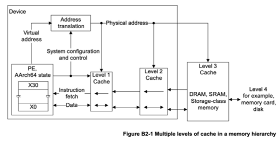

# Memory

Back in 1945 John von Neumann wrote a document called [_First Draft of a Report on the EDVAC_](https://web.mit.edu/STS.035/www/PDFs/edvac.pdf) [@10.1109/85.238389],
which described a design for a new type of electronic computer.
People debate to what extent these were his ideas alone versus what was borrowed from existing designs, but he didn't give credit
to other people and he was pretty famous so we now call what he described the _von Neumann architecture_ [@10.5555/2898944].  Many real systems would be built from the design in the document, and even today most computers have this architecture.  One of the key
ideas was that programs would be stored in memory along with data, and the processors of the computer would fetch the instructions from memory.  Seems
pretty obvious now, but it was a big step forward from, say, plugging wires into boards or flipping switches.

So in one way the programs i wrote back in the 80s on 8086/8088 processors were similar to programs I would write now on the ARM64-based
M2 in my Mac.  The program from the last episode would be stored in memory and the CPU would fetch the instructions to execute.  However,
in other ways this is one of the most significant differences between then and now.

For one, there's a whole heck of a lot more of the stuff.  My original IBM PC had 64 KB of memory (yes, __K__, as in kilobyte).  My
Mac has 24 GB, which i frequently exceed.  One time in college when i wanted to upgrade my PC to 128 KB, i went to some dingy electronics shop and bought 9 chips that were pressed into a chunk of foam (one chip for each bit, plus one for a parity bit). I had to remove the PC case and then shove those chips into sockets on the motherboard.  At some point in the 90s they started putting the individual chips called _inline modules_.  Throughout the 90s and early 2000s it was common to buy memory memory modules to add to your computer.
I'm fairly sure that if i look sideways at the bottom panel of my Mac it voids my warranty.

Part of the reason why there's so much more memory is due to advances in chip fabrication, but also there are  more bits available for
making addresses.  The IBM PC that I had back in the day was based on a variant of the 16-bit Intel 8086 chip called the 8088. It used two 16-bit
registers to address memory.  The mathematically astute will notice that this adds up to 32 bits, _but_ the 8088 actually only used 20 bits (long story),
so it had an addressable space of 2^20, or 1 MB.  However, only 640 KB of this was available for programs because the rest was used as a video
buffer (although if you didn't mind the screen being jacked up, you _could_ use the video buffer to store data).  Different times.

I don't have a lot of information on the memory in my Mac.  I know that it uses something called Low Power Double Data Rate 5 (LPDDR5) SDRAM made by a company called SK Hynix.
I know it's very fast, 100 GB/s bandwidth or something like that.  There's a 128-bit bus, so that the processor could grab a double precision float in one clock cycle.
  I don't know why the Macbook Air tops out at 24 GB, other than that
it probably has something to do with space and heat.

## Virtual memory 

Second, my Mac has a sophisticated virtual memory system, which was not supported by either MS-DOS or the hardware i had.  Virtual memory gives every program it's own private address space that has to be translated into physical memory addresses.
Virtual memory also uses disk storage to make the computer seem like it has more memory.  This is mostly transparent to users and programmers.  My 1980s
IBM PC only had 2 5.25 inch floppy drives, so if it had attempted virtual memory it woulda been hella noticeable.  More on that another day.

## Caches and address translation
Finally, the M2 in my Mac has _caches_.  This means that data and the instructions for a program are loaded into a memory in the CPU (a cache) so that
fetching them doesn't take as long as a regular memory access.  The 8086/8088 didn't have a cache as such but it did have what it called a _prefetch
queue_ or an instruction queue. [@shirriff2024prefetch] has some great details on the 8086 memory.

So, the instructions are in the computer's memory.  Both the new M2 and the old 8088 would have to fetch the instructions from the memory.
execute the instructions in the CPU and then return any result to memory. The fetchs and stores are _extremely_ fast in modern computers
(measure in nanoseconds), but still it would make the computer slower if you had to go back and forth from CPU to DRAM on every instruction[^1].
So, most computers have an instruction cache in the CPU.  It's up to 192 KB in my Mac.  Actually, this is only one _level_ of cache (the so-called
L1 cache).  The M2 also has a second level of cache (L2 naturally) that's up to 16 MB. [^2]

The image below (taken from the ARM Architecture Reference Manual) shows both the cache levels and the
_address translation_ that takes place to map virtual addresses (the addresses we use in our programs)
to the physical address of a memory location.  This is part of the hardware because it needs to be
very fast.


That _Address Translation_ box is essentially what's called the memory management unit, MMU [@arm_aarch64_mmu]. It's purpose
is literally to take a number that addresses a virtual memory location and translate it into a number
that addresses somewhere in physical memory (which might be in somewhere in a cache)
The reason for using virtual addresses will become clearer in future chapters, but suffice it to say
for now that it lets each program treat memory as its own personal workspace without worrying about
the constraints of availably physical memory or the location of other programs in physical memory.
In the old days of my PC these were not major concerns because the operating systems only allowed
one user program to run at a time. This meant that memory management was relatively simple, as there was no need to protect one program's memory from another. Modern operating systems, however, allow multiple programs to run simultaneously, which requires more sophisticated memory management techniques to ensure that each program has its own protected memory space.

You might wonder "If cache memory is so much faster, why not make _all_ of the memory the same as the cache memory"?  Good question, you're very smart.
The chief reason is that cache memory is typically _static RAM_ (SRAM) while regular memory is _dynamic_ RAM (DRAM).  The former is faster, but also takes
more space (more transistors) and more power and so generates more heat.  If you _really_ want to delve into the details of memory, 
i recommend the document _What Every Programmer Should Know About Memory_ [@drepper2007memory]

## Example of loading and storing data in memory

Let's make another silly program that adds two numbers (NOTE: sometimes in references on ARM64 assembly you'll see instructions like __LDR X1, =mya1__ 
in place of the __ADRP X1, mya1@PAGE; ADD X1, X1, mya1@PAGEOFF__, but that doesn't work with the Mac OS assembler):

```asm
//
//  Add some things
//
.global _start             // Provide program starting address to linker
.align 4

_start:
    // Load mya1 into X2 register
    ADRP X1, mya1@PAGE
    ADD X1, X1, mya1@PAGEOFF
    LDR W2, [X1]

    // Load mya2 into X4 register
    ADRP X3, mya2@PAGE
    ADD X3, X3, mya2@PAGEOFF
    LDR W4, [X3]

    // Add 'em up
    ADD X2, X4, X2

    //  Shove it back into memory
    ADRP X5, mys1@PAGE
    ADD X5, X5, mys1@PAGEOFF
    STR X2, [X5]

    // Breakpoint
    BRK #2

.data
mya1:  .word  17
mya2:  .word  25
mys1:  .word  0
```

I stuck a breakpoint at the end of this program so that i can run it in the __lldb__ debugger.  If I run the program
and then disassemble it after it hits the breakpoint, i see this

```
(lldb) di -b
adder`start:
    0x100003f70 <+0>:  0xb0000001   adrp   x1, 1
    0x100003f74 <+4>:  0x91000021   add    x1, x1, #0x0 ; mya1
    0x100003f78 <+8>:  0xb9400022   ldr    w2, [x1]
    0x100003f7c <+12>: 0xb0000003   adrp   x3, 1
    0x100003f80 <+16>: 0x91001063   add    x3, x3, #0x4 ; mya2
    0x100003f84 <+20>: 0xb9400064   ldr    w4, [x3]
    0x100003f88 <+24>: 0x8b020082   add    x2, x4, x2
    0x100003f8c <+28>: 0xb0000005   adrp   x5, 1
    0x100003f90 <+32>: 0x910020a5   add    x5, x5, #0x8 ; mys1
    0x100003f94 <+36>: 0xf90000a2   str    x2, [x5]
->  0x100003f98 <+40>: 0xd4200040   brk    #0x2
```
So, same program, but on the left you can see the memory addresses of the specific instructions.  If I actually dump memory starting at 0x100003f70
I get:

```
0x100003f70: 01 00 00 b0 21 00 00 91 22 00 40 b9 03 00 00 b0  ....!...".@.....
0x100003f80: 63 10 00 91 64 00 40 b9 82 00 02 8b 05 00 00 b0  c...d.@.........
0x100003f90: a5 20 00 91 a2 00 00 f9 40 00 20 d4 01 00 00 00  . ......@. .....
0x100003fa0: 1c 00 00 00 00 00 00 00 1c 00 00 00 00 00 00 00  ................
0x100003fb0: 1c 00 00 00 02 00 00 00 70 3f 00 00 40 00 00 00  ........p?..@...
0x100003fc0: 40 00 00 00 9c 3f 00 00 00 00 00 00 40 00 00 00  @....?......@...
0x100003fd0: 00 00 00 00 00 00 00 00 00 00 00 00 03 00 00 00  ................
0x100003fe0: 0c 00 01 00 10 00 01 00 00 00 00 00 00 00 00 00  ................
0x100003ff0: 00 00 00 00 00 00 00 00 00 00 00 00 00 00 00 00  ................
0x100004000: 11 00 00 00 19 00 00 00 2a 00 00 00 00 00 00 00  ........*.......
```

Obvi, no?  You can see though how the contents of memory correspond to the instructions
in the disassembly


0x010000B0 -> 0x100003f70: __01 00 00 b0__ 21 00 00 91 22 00 40 b9 03 00 00 b0 <br>
0x21000091 -> 0x100003f70: 01 00 00 b0 __21 00 00 91__ 22 00 40 b9 03 00 00 b0 <br>
0x220040B9 -> 0x100003f70: 01 00 00 b0 21 00 00 91 __22 00 40 b9__ 03 00 00 b0 <br>


Notice at the bottom there we also see our input and out data: <br>

0x100004000: __11__ 00 00 00 __19__ 00 00 00 __2a__ 00 00 00 00 00 00 00__ <br>

where 0x11 = 17, 0x19 = 25 and 0x2a = 42.

One thing to note here about the data in memory when we look at these memory dumps: they might at first
glance look sorta backwards.  For example the value 0x11 or 17 is actually held in 32 bits representing
an integer (ie 11 00 00 00).  Note though that the as we go from left to right, the address of the bytes
is _increasing_, so the byte holding the bits for 0x11 is at the _lowest_ address.  This ordering
of bytes has the somewhat peculiar name _little-endian_.  Some microprocessors do use the opposite
convention, which is called... did you guess it?  Yes, _big-endian_.

So, that's our program (and data) "in memory".  The CPU fetches the instructions from memory and when instructed data values are transferred
from memory into registers.  However, where the data actually comes from is harder to say than it seems.  First, remember these are virtual addresses.  Second, when the processor fetches the
instruction from 0x100003f70 it simultaneously tries both the cache and regular memory.  If it's a cache hit, then the memory fetch is
cancelled.  This seems complicated, but it eliminates checking the cache before starting a memory fetch.

Another detail regarding this processor.  While the instructions and data are in the same memory as per the von Neumann architecture,
the processor actually has separate buses for instructions and data, and also separate caches.  Using separate memories for data and instructions
is called the _Harvard architecture_, supposedly because this was the architecture of another early computer, the Mark I built at Harvard
(though apparently nobody called it that until much later, see [Wikipedia](https://en.wikipedia.org/wiki/Harvard_architecture)).  So, anyway
people sometimes say the ARM chips have a Harvard or modified Harvard architecture.  

There are still many questions about memory and programs, one of which is "how does the program get into memory?".  Another thing that
I've glossed over so far is the role of the operating system in all of this, which is what I'll start to
cover in [Episode @sec-programs]


[^1]: This is called the _Von Neumann bottleneck_, so taking credit for stuff is not all upside.
[^2]: Another difference between the ARM and the Intel chips are that the former is a _reduced instruction set computer_ (RISC)
while the latter is a _complex instruction set computer_.  This pertains to memory in that computers of the latter type can execute
multiple low-level operations with one instruction (like load data, do something to it, then store it).


